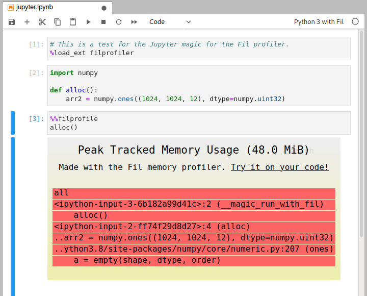

# Profiling in Jupyter

To measure peak memory usage of some code in Jupyter you need to do three things:

## Using Fil in Jupyter

### 1. Use "Python 3 with Fil" kernel

Jupyter notebooks run with a particular "kernel", which most of the time just determines which programming language the notebook is using, like Python or R.
Fil support in Jupyter requires a special kernel, so instead of using the "Python 3" kernel you'll use the "Python 3 with Fil" kernel.

There are two ways to choose this kernel:

1. You can choose this kernel when you create a new notebook.
2. You can switch an existing notebook in the Kernel menu.
   There should be a "Change Kernel" option in there in both Jupyter Notebook and JupyterLab.
   
### 2. Load the extension

In one of the cells in your notebook, add this to the cell:

```python
%load_ext filprofiler
```

### 3. Profiling a particular cell

You can now do memory profiles of particular cells by adding `%%filprofile` as the first line of the cell.

2. Load the extension by doing `%load_ext filprofiler`.
3. Add the `%%filprofile` magic to the top of the cell with the code you wish to profile.

## An example

Here's an example session:


